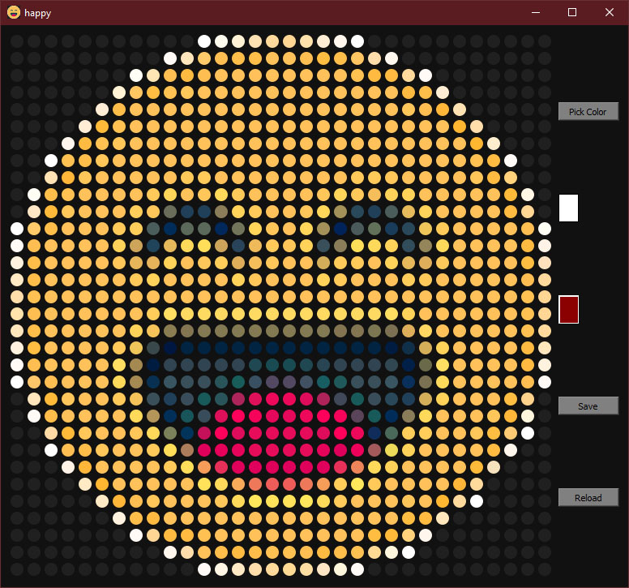

# PROGMEM Image Editor

## Description
Open and Edit Images, Icons and C/C++ PROGMEM image data arrays and Save as C style header files.
Useful for working with Arduino powered LED Matrix Panels needing to display images. 
Especially when using the Adafruit_GFX, Adafruit_NeoMatrix, Adafruit_NeoPixel libraries.

## Table of Contents
- [Description](#description)
- [Usage](#usage)
- [Screenshot](#screenshot)
- [Example Output](#example-output)
- [License](#license)

## Usage
1. Provide a file path to the script from the command line or be prompted with a File Select Dialog at runtime. 
2. Select from 2 on screen brush colors.
3. Change those colors with the Color Dialog.
4. Paint the pixels with all those pretty colors.
5. Save the results as a C style header file.

## Screenshot


## Example Output
```
// Generated by   : QcentICON Editor v0.1
// Generated from : happy.gif
// Image Size     : 32x32 pixels


#if defined(__AVR__)
#include <avr/pgmspace.h>
#elif defined(__PIC32MX__)
#define PROGMEM
#elif defined(__arm__)
#define PROGMEM
#endif

const unsigned short
    happy_DATA[1025] PROGMEM =
        {
            (32 << 8) | 32, // First two bytes: width and height
            0x2104, 0x2104, 0x2104, 0x2104, 0x2104, 0x2104, 0x2104, 0x2104, 0x2104, 0x2104, 0x2104, 0xFFFF, 0xFFDD, 0xFF9A, 0xFF16, 0xFED3, 0xFEB2, 0xFF15, 0xFF7A, 0xFFBD, 0xFFFF, 0x2104, 0x2104, 0x2104, 0x2104, 0x2104, 0x2104, 0x2104, 0x2104, 0x2104, 0x2104, 0x2104, // 0x0000 (32 pixels)
            0x2104, 0x2104, 0x2104, 0x2104, 0x2104, 0x2104, 0x2104, 0x2104, 0x2104, 0xFFDE, 0xFF37, 0xFE4D, 0xFDEA, 0xFDE9, 0xFDE9, 0xFE0B, 0xFE0B, 0xFDEA, 0xFDE8, 0xFDE9, 0xFE2C, 0xFEF5, 0xFFBD, 0x2104, 0x2104, 0x2104, 0x2104, 0x2104, 0x2104, 0x2104, 0x2104, 0x2104, // 0x0020 (64 pixels)
            0x2104, 0x2104, 0x2104, 0x2104, 0x2104, 0x2104, 0x2104, 0xFFFE, 0xFF36, 0xFDEA, 0xFDC8, 0xFDEA, 0xFE0B, 0xFE0B, 0xFE0B, 0xFE0B, 0xFE0B, 0xFE0B, 0xFE0B, 0xFE0B, 0xFE0A, 0xFDC8, 0xFDC8, 0xFED3, 0xFFDE, 0x2104, 0x2104, 0x2104, 0x2104, 0x2104, 0x2104, 0x2104, // 0x0040 (96 pixels)
            0x2104, 0x2104, 0x2104, 0x2104, 0x2104, 0x2104, 0xFF9A, 0xFE2C, 0xFDE8, 0xFE0A, 0xFE2B, 0xFE0B, 0xFE0B, 0xFE0B, 0xFE0B, 0xFE0B, 0xFE0B, 0xFE0B, 0xFE0B, 0xFE0B, 0xFE0B, 0xFE0B, 0xFE0B, 0xFDC8, 0xFDE9, 0xFF7A, 0x2104, 0x2104, 0x2104, 0x2104, 0x2104, 0x2104, // 0x0060 (128 pixels)
            0x2104, 0x2104, 0x2104, 0x2104, 0x2104, 0xFF7A, 0xFDE9, 0xFE0B, 0xFE0B, 0xFE0B, 0xFE0B, 0xFE0B, 0xFE0B, 0xFE0B, 0xFE0B, 0xFE0B, 0xFE0B, 0xFE0B, 0xFE0B, 0xFE0B, 0xFE0B, 0xFE0B, 0xFE0B, 0xFE2B, 0xFDEA, 0xFDA7, 0xFF16, 0x2104, 0x2104, 0x2104, 0x2104, 0x2104, // 0x0080 (160 pixels)
            0x2104, 0x2104, 0x2104, 0x2104, 0xFF7A, 0xFDC7, 0xFE0A, 0xFE0B, 0xFE0B, 0xFE0B, 0xFE0B, 0xFE0B, 0xFE0B, 0xFE0B, 0xFE0B, 0xFE0B, 0xFE0B, 0xFE0B, 0xFE0B, 0xFE0B, 0xFE0B, 0xFE0B, 0xFE0B, 0xFE0B, 0xFE0B, 0xFE0B, 0xFDA6, 0xFEF5, 0x2104, 0x2104, 0x2104, 0x2104, // 0x00A0 (192 pixels)
            0x2104, 0x2104, 0x2104, 0xFFBD, 0xFDC8, 0xFE0A, 0xFE2B, 0xFE0B, 0xFE0B, 0xFE0B, 0xFE0B, 0xFE0B, 0xFE0B, 0xFE0B, 0xFE0B, 0xFE0B, 0xFE0B, 0xFE0B, 0xFE0B, 0xFE0B, 0xFE0B, 0xFE0B, 0xFE0B, 0xFE0B, 0xFE0B, 0xFE0B, 0xFE0B, 0xFDA6, 0xFF79, 0x2104, 0x2104, 0x2104, // 0x00C0 (224 pixels)
            0x2104, 0x2104, 0xFFFF, 0xFE0A, 0xFDE9, 0xFE2B, 0xFE0B, 0xFE0B, 0xFE0B, 0xFE0B, 0xFE0B, 0xFE0B, 0xFE0B, 0xFE0B, 0xFE0B, 0xFE0B, 0xFE0B, 0xFE0B, 0xFE0B, 0xFE0B, 0xFE0B, 0xFE0B, 0xFE0B, 0xFE0B, 0xFE0B, 0xFE0B, 0xFE0B, 0xFE0A, 0xFDC8, 0xFFDE, 0x2104, 0x2104, // 0x00E0 (256 pixels)
            0x2104, 0x2104, 0xFF16, 0xFDA7, 0xFE2B, 0xFE0B, 0xFE0B, 0xFE0B, 0xFE0B, 0xFE0B, 0xFE4B, 0xFE4B, 0xFE0B, 0xFE0B, 0xFE0B, 0xFE0B, 0xFE0B, 0xFE0B, 0xFE0B, 0xFE0B, 0xFE4B, 0xFE4B, 0xFE2B, 0xFE0B, 0xFE0B, 0xFE0B, 0xFE0B, 0xFE2B, 0xFDC8, 0xFE8F, 0x2104, 0x2104, // 0x0100 (288 pixels)
            0x2104, 0xFFFE, 0xFDE9, 0xFE0A, 0xFE0B, 0xFE0B, 0xFE0B, 0xFE0B, 0xFE4B, 0xFEAB, 0xFE0B, 0xFE2B, 0xFECB, 0xFE4B, 0xFE0B, 0xFE0B, 0xFE0B, 0xFE0B, 0xFE2B, 0xFEAB, 0xFE4B, 0xF5EB, 0xFE8B, 0xFE8B, 0xFE0B, 0xFE0B, 0xFE0B, 0xFE0B, 0xFE0B, 0xFDC7, 0xFFBC, 0x2104, // 0x0120 (320 pixels)
            0x2104, 0xFF38, 0xFDC7, 0xFE2B, 0xFE0B, 0xFE0B, 0xFE0B, 0xFE6B, 0xFE2B, 0x6B6B, 0x220B, 0x220B, 0x8BEB, 0xFE8B, 0xFE4B, 0xFE0B, 0xFE0B, 0xFE2B, 0xFEAB, 0xA48B, 0x2A4B, 0x220B, 0x4AEB, 0xE5CB, 0xFE8B, 0xFE0B, 0xFE0B, 0xFE0B, 0xFE0B, 0xFDC8, 0xFEB2, 0x2104, // 0x0140 (352 pixels)
            0xFFFF, 0xFE4D, 0xFDE9, 0xFE0B, 0xFE0B, 0xFE0B, 0xFE4B, 0xFE6B, 0x4AEB, 0x016B, 0x5B4B, 0x5B4B, 0x014B, 0x73AB, 0xFEAB, 0xFE2B, 0xFE0B, 0xFEAB, 0xA48B, 0x012B, 0x4ACB, 0x638B, 0x19EB, 0x2A4B, 0xEE2B, 0xFE4B, 0xFE0B, 0xFE0B, 0xFE0B, 0xFE0B, 0xFDEA, 0xFFFE, // 0x0160 (384 pixels)
            0xFFDE, 0xFDEA, 0xFE0B, 0xFE0B, 0xFE0B, 0xFE0B, 0xFE8B, 0xCD2B, 0x222B, 0xE5CB, 0xFECB, 0xFEEB, 0xCD2B, 0x2A2B, 0xEDCB, 0xFE4B, 0xFE2B, 0xFE8B, 0x3A8B, 0x8BEB, 0xFEEB, 0xFECB, 0xFE8B, 0x326B, 0x942B, 0xFECB, 0xFE0B, 0xFE0B, 0xFE0B, 0xFE0B, 0xFDC8, 0xFF9C, // 0x0180 (416 pixels)
            0xFF9B, 0xFDE9, 0xFE0B, 0xFE0B, 0xFE0B, 0xFE0B, 0xFE2B, 0xE5AB, 0xE58B, 0xFE8B, 0xFE0B, 0xFE2B, 0xFE6B, 0xDD6B, 0xF5EB, 0xFE2B, 0xFE0B, 0xFE0B, 0xD56B, 0xFE4B, 0xFE4B, 0xFE0B, 0xFE8B, 0xE5CB, 0xDD6B, 0xFE4B, 0xFE0B, 0xFE0B, 0xFE0B, 0xFE0B, 0xFDE8, 0xFF17, // 0x01A0 (448 pixels)
            0xFF58, 0xFDE9, 0xFE0B, 0xFE0B, 0xFE0B, 0xFE0B, 0xFE0B, 0xFE4B, 0xFE8B, 0xFE0B, 0xFE0B, 0xFE0B, 0xFE0B, 0xFE8B, 0xFE2B, 0xFE0B, 0xFE0B, 0xFE0B, 0xFE8B, 0xFE4B, 0xFE0B, 0xFE0B, 0xFE0B, 0xFE6B, 0xFE4B, 0xFE0B, 0xFE0B, 0xFE0B, 0xFE0B, 0xFE0B, 0xFDEA, 0xFED3, // 0x01C0 (480 pixels)
            0xFEF5, 0xFE0A, 0xFE0B, 0xFE0B, 0xFE0B, 0xFE0B, 0xFE0B, 0xFE0B, 0xFE0B, 0xFE0B, 0xFE0B, 0xFE0B, 0xFE0B, 0xFE0B, 0xFE0B, 0xFE0B, 0xFE0B, 0xFE0B, 0xFE0B, 0xFE0B, 0xFE0B, 0xFE0B, 0xFE0B, 0xFE0B, 0xFE0B, 0xFE0B, 0xFE0B, 0xFE0B, 0xFE0B, 0xFE0B, 0xFE0A, 0xFEB2, // 0x01E0 (512 pixels)
            0xFF15, 0xFDEA, 0xFE0B, 0xFE0B, 0xFE0B, 0xFE0B, 0xFE0B, 0xFE0B, 0xFE6B, 0xFEEC, 0xFECC, 0xFECC, 0xFECC, 0xFECC, 0xFECC, 0xFECC, 0xFECC, 0xFECC, 0xFECC, 0xFECC, 0xFECC, 0xFECC, 0xFEEC, 0xFE8B, 0xFE0B, 0xFE0B, 0xFE0B, 0xFE0B, 0xFE0B, 0xFE0B, 0xFE0A, 0xFEB2, // 0x0200 (544 pixels)
            0xFF37, 0xFDE9, 0xFE0B, 0xFE0B, 0xFE0B, 0xFE0B, 0xFE0B, 0xFE8B, 0xF60B, 0x8BEA, 0x83AA, 0x83CA, 0x83CA, 0x83CA, 0x83CA, 0x83CA, 0x83CA, 0x83CA, 0x83CA, 0x83AA, 0x83AA, 0x7BAA, 0x7B8A, 0xDD6B, 0xFEAC, 0xFE0B, 0xFE0B, 0xFE0B, 0xFE0B, 0xFE0B, 0xFE0A, 0xFED3, // 0x0220 (576 pixels)
            0xFF9B, 0xFDE8, 0xFE0B, 0xFE0B, 0xFE0B, 0xFE0B, 0xFE4B, 0xEE2B, 0x3A49, 0x00C8, 0x0128, 0x0128, 0x0128, 0x0128, 0x0128, 0x0128, 0x0128, 0x0128, 0x0128, 0x0128, 0x0128, 0x0128, 0x00E8, 0x1189, 0xD56B, 0xFE8B, 0xFE0B, 0xFE0B, 0xFE0B, 0xFE0B, 0xFDC8, 0xFF37, // 0x0240 (608 pixels)
            0xFFDE, 0xFDEA, 0xFE0B, 0xFE0B, 0xFE0B, 0xFE0B, 0xFEEC, 0xA44A, 0x00E8, 0x322A, 0x322A, 0x322A, 0x322A, 0x322A, 0x224A, 0x1A6A, 0x1A6A, 0x224A, 0x2A2A, 0x322A, 0x322A, 0x322A, 0x324A, 0x0109, 0x6B49, 0xFEEC, 0xFE0B, 0xFE0B, 0xFE0B, 0xFE0B, 0xFDC8, 0xFF9B, // 0x0260 (640 pixels)
            0xFFFF, 0xFE2D, 0xFDEA, 0xFE0B, 0xFE0B, 0xFE0B, 0xFECB, 0xA44A, 0x098A, 0x3AAC, 0x3A8B, 0x3A8B, 0x2AAB, 0x1AEB, 0x3A8C, 0x524C, 0x524C, 0x428C, 0x1AEC, 0x22CB, 0x3A8B, 0x3A8B, 0x3AAC, 0x098B, 0x7B8A, 0xFECB, 0xFE0B, 0xFE0B, 0xFE0B, 0xFE0B, 0xFDEA, 0xFFDE, // 0x0280 (672 pixels)
            0x2104, 0xFF37, 0xFDC7, 0xFE2B, 0xFE0B, 0xFE0B, 0xFE4B, 0xF60B, 0x3A8B, 0x220B, 0x3A6B, 0x1ACB, 0x2AAB, 0xA92B, 0xD88B, 0xE84B, 0xE84B, 0xD86B, 0xA92B, 0x424B, 0x1ACB, 0x3A6B, 0x2A4B, 0x220B, 0xD56B, 0xFE8B, 0xFE0B, 0xFE0B, 0xFE0B, 0xFDE8, 0xFE91, 0x2104, // 0x02A0 (704 pixels)
            0x2104, 0xFFDE, 0xFDE9, 0xFE0B, 0xFE0B, 0xFE0B, 0xFE0B, 0xFECB, 0xB4AB, 0x018B, 0x1AAB, 0x3A6B, 0xD88B, 0xF80B, 0xF02B, 0xE04B, 0xE04B, 0xE84B, 0xF80B, 0xF02B, 0x5A2B, 0x1ACB, 0x016B, 0x8BEB, 0xFECB, 0xFE0B, 0xFE0B, 0xFE0B, 0xFE2B, 0xFDA7, 0xFFBB, 0x2104, // 0x02C0 (736 pixels)
            0x2104, 0x2104, 0xFED4, 0xFDC7, 0xFE2B, 0xFE0B, 0xFE0B, 0xFE2B, 0xFECB, 0x7C0B, 0x01AB, 0xC08B, 0xF80B, 0xD86B, 0xE06B, 0xE06B, 0xE06B, 0xE06B, 0xD86B, 0xF80B, 0xE84B, 0x116B, 0x4B4B, 0xFE6B, 0xFE6B, 0xFE0B, 0xFE0B, 0xFE2B, 0xFDE8, 0xFE4E, 0xFFFF, 0x2104, // 0x02E0 (768 pixels)
            0x2104, 0x2104, 0xFFFF, 0xFDEA, 0xFDE9, 0xFE2B, 0xFE0B, 0xFE0B, 0xFE4B, 0xFEEB, 0xABEB, 0xD80B, 0xE00B, 0xE02B, 0xE06B, 0xE06B, 0xE06B, 0xE06B, 0xE02B, 0xD80B, 0xE80B, 0xA2CB, 0xEECB, 0xFE8B, 0xFE0B, 0xFE0B, 0xFE0B, 0xFE0B, 0xFDC8, 0xFFBD, 0x2104, 0x2104, // 0x0300 (800 pixels)
            0x2104, 0x2104, 0x2104, 0xFF9C, 0xFDA7, 0xFE0B, 0xFE0B, 0xFE0B, 0xFE0B, 0xFE4B, 0xFEEB, 0xF4EB, 0xE18B, 0xD80B, 0xD80B, 0xD80B, 0xD80B, 0xD80B, 0xD80B, 0xE18B, 0xEC2B, 0xFECB, 0xFE8B, 0xFE0B, 0xFE0B, 0xFE0B, 0xFE0B, 0xFDC7, 0xF717, 0x2104, 0x2104, 0x2104, // 0x0320 (832 pixels)
            0x2104, 0x2104, 0x2104, 0x2104, 0xFF58, 0xFDA6, 0xFE0B, 0xFE0B, 0xFE0B, 0xFE0B, 0xFE0B, 0xFF0B, 0xFECB, 0xF54B, 0xEBCB, 0xEAEB, 0xEAEB, 0xEBCB, 0xF4EB, 0xFE6B, 0xFF2B, 0xFE4B, 0xFE0B, 0xFE0B, 0xFE0B, 0xFE0B, 0xFDA7, 0xFED3, 0x2104, 0x2104, 0x2104, 0x2104, // 0x0340 (864 pixels)
            0x2104, 0x2104, 0x2104, 0x2104, 0x2104, 0xFF58, 0xFDA7, 0xFDEA, 0xFE2B, 0xFE0B, 0xFE0B, 0xFE0B, 0xFE2B, 0xFECB, 0xFF2B, 0xFF0B, 0xFF0B, 0xFF2B, 0xFECB, 0xFE4B, 0xFE0B, 0xFE0B, 0xFE0B, 0xFE2B, 0xFE0B, 0xFDA6, 0xFED3, 0xFFFF, 0x2104, 0x2104, 0x2104, 0x2104, // 0x0360 (896 pixels)
            0x2104, 0x2104, 0x2104, 0x2104, 0x2104, 0x2104, 0xFF9B, 0xFDE9, 0xFDC8, 0xFE0B, 0xFE0B, 0xFE0B, 0xFE0B, 0xFE0B, 0xFE0B, 0xFE0B, 0xFE0B, 0xFE0B, 0xFE0B, 0xFE0B, 0xFE0B, 0xFE0B, 0xFE0B, 0xFDE8, 0xFDC8, 0xFF37, 0x2104, 0x2104, 0x2104, 0x2104, 0x2104, 0x2104, // 0x0380 (928 pixels)
            0x2104, 0x2104, 0x2104, 0x2104, 0x2104, 0x2104, 0x2104, 0xFFDE, 0xFEB2, 0xFDC8, 0xFDC8, 0xFE0A, 0xFE0B, 0xFE0B, 0xFE0B, 0xFE0B, 0xFE0B, 0xFE0B, 0xFE0B, 0xFE0B, 0xFE0B, 0xFDE8, 0xFDC7, 0xFE8F, 0xFFBD, 0x2104, 0x2104, 0x2104, 0x2104, 0x2104, 0x2104, 0x2104, // 0x03A0 (960 pixels)
            0x2104, 0x2104, 0x2104, 0x2104, 0x2104, 0x2104, 0x2104, 0x2104, 0x2104, 0xFFBD, 0xFEF5, 0xFE0B, 0xFDE9, 0xFDC8, 0xFDE9, 0xFE0A, 0xFE0A, 0xFDEA, 0xFDC8, 0xFDE9, 0xFE0A, 0xFED2, 0xFFBB, 0xFFFF, 0x2104, 0x2104, 0x2104, 0x2104, 0x2104, 0x2104, 0x2104, 0x2104, // 0x03C0 (992 pixels)
            0x2104, 0x2104, 0x2104, 0x2104, 0x2104, 0x2104, 0x2104, 0x2104, 0x2104, 0x2104, 0x2104, 0xFFDE, 0xFFBC, 0xFF58, 0xFEF5, 0xFED3, 0xFED2, 0xFEF4, 0xFF38, 0xFFBB, 0xFFDE, 0x2104, 0x2104, 0x2104, 0x2104, 0x2104, 0x2104, 0x2104, 0x2104, 0x2104, 0x2104, 0x2104, // 0x03E0 (1024 pixels)
};
const unsigned short *happy = happy_DATA + 1;

```

## License
MIT License
[View License](http://choosealicense.com/licenses/mit/)

MIT License

Copyright (c) [2024] [Dave Quinn]

Permission is hereby granted, free of charge, to any person obtaining a copy
of this software and associated documentation files (the "Software"), to deal
in the Software without restriction, including without limitation the rights
to use, copy, modify, merge, publish, distribute, sublicense, and/or sell
copies of the Software, and to permit persons to whom the Software is
furnished to do so, subject to the following conditions:

The above copyright notice and this permission notice shall be included in all
copies or substantial portions of the Software.

THE SOFTWARE IS PROVIDED "AS IS", WITHOUT WARRANTY OF ANY KIND, EXPRESS OR
IMPLIED, INCLUDING BUT NOT LIMITED TO THE WARRANTIES OF MERCHANTABILITY,
FITNESS FOR A PARTICULAR PURPOSE AND NONINFRINGEMENT. IN NO EVENT SHALL THE
AUTHORS OR COPYRIGHT HOLDERS BE LIABLE FOR ANY CLAIM, DAMAGES OR OTHER
LIABILITY, WHETHER IN AN ACTION OF CONTRACT, TORT OR OTHERWISE, ARISING FROM,
OUT OF OR IN CONNECTION WITH THE SOFTWARE OR THE USE OR OTHER DEALINGS IN THE
SOFTWARE.

